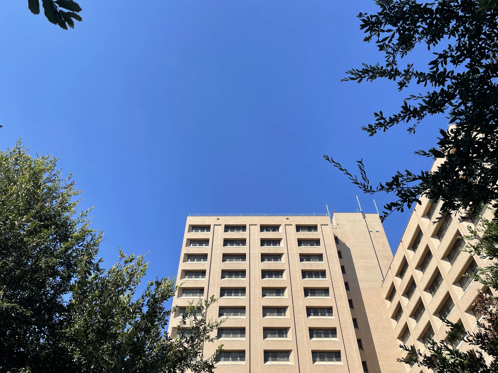
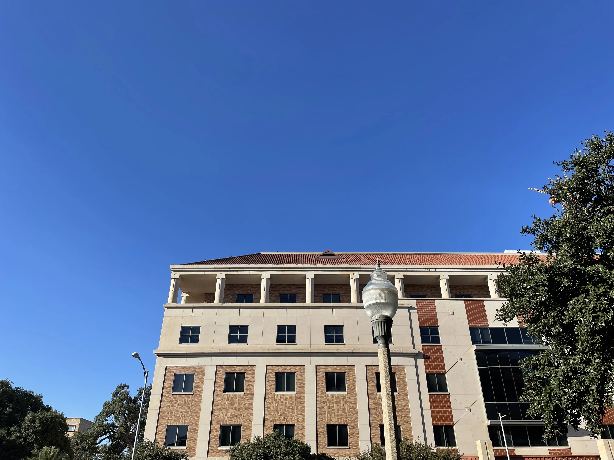
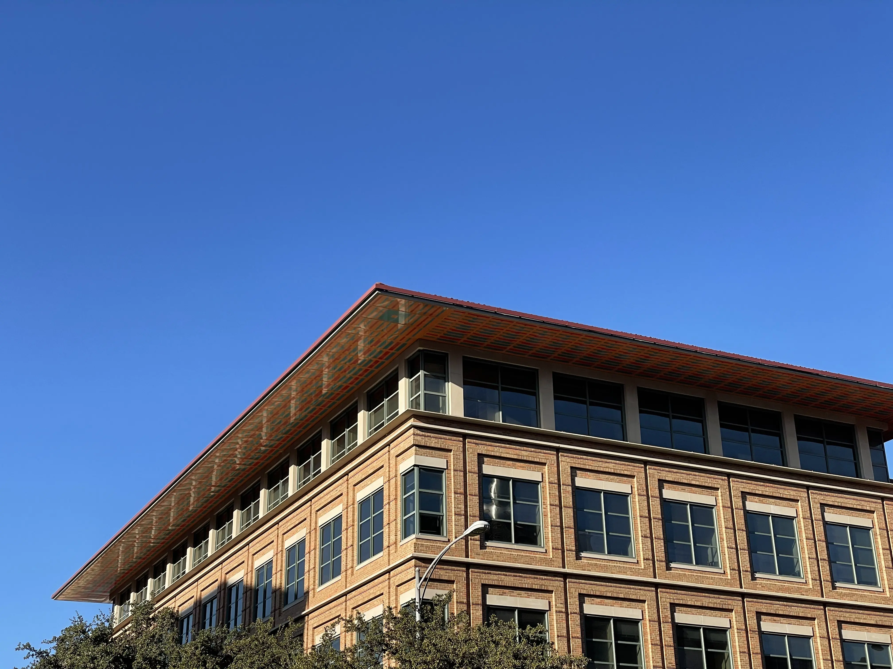
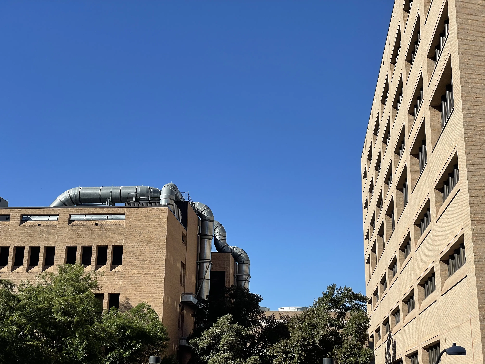
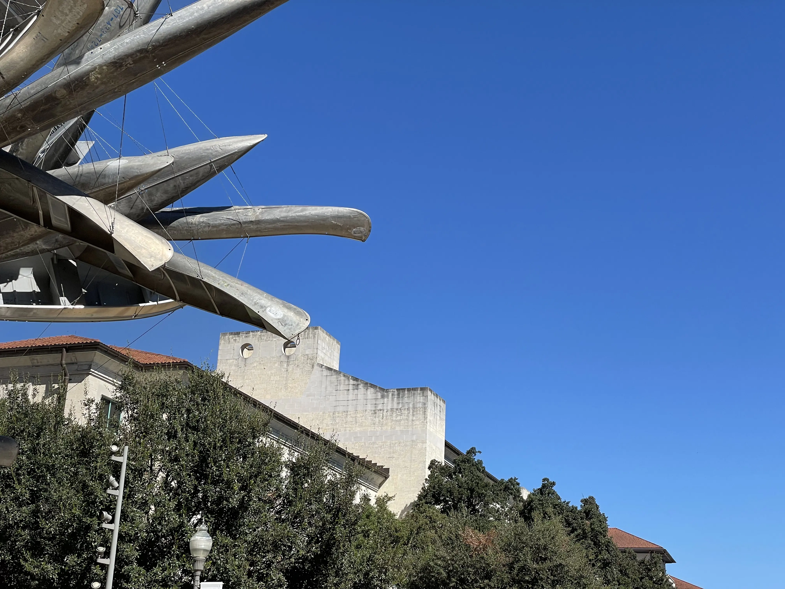
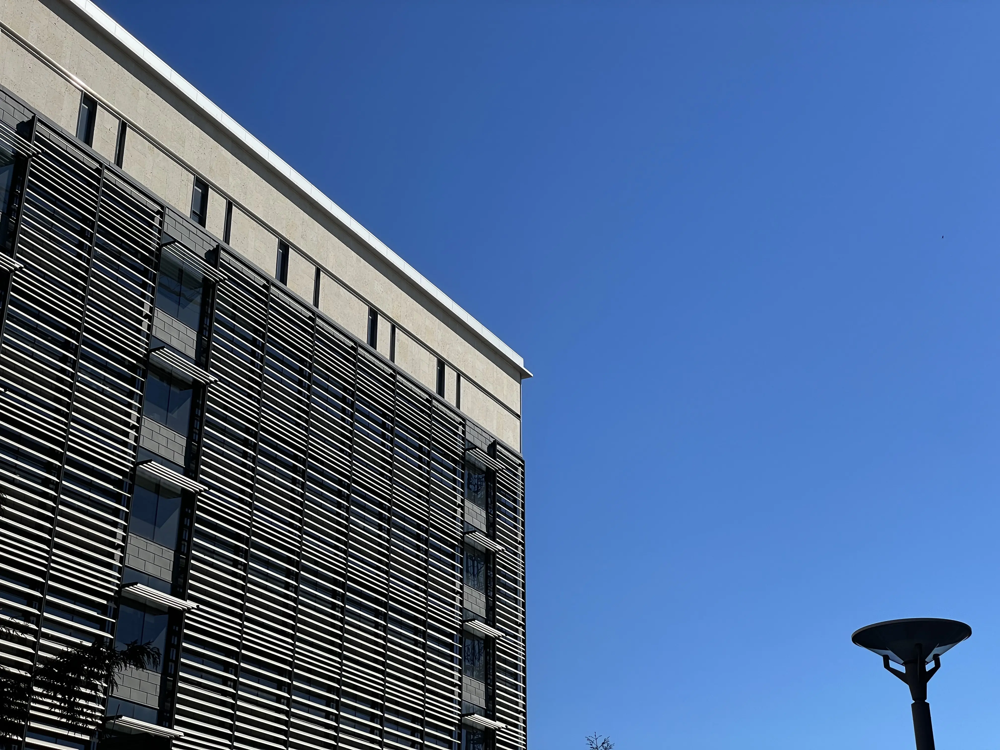

import Quote from '../../components/Quote.astro';
export const components = {blockquote: Quote};

For the first time in a long time I’ve begun to relish perfectly blue skies. I think it has something to do with being on my own for the first time. Where I was once held back by hometown inhibitions, I am now free to explore the world without anyone there to stop me. It’s invigorating. It has the effect that, whenever I look up into the sky, I am filled with an almost childlike sense of wonder. It’s one of those feelings that rides right up on the tip of you tongue, but that is impossible to accurately describe--the closest relation I can make is the taste of pineapple. Nonetheless whenever I am walking through campus on a picturesque, cloud-free day, I can’t help but look up at the sky and become flooded with a feeling of immense joy. In some ways it takes me back to the times of my childhood; I think of the clear skies on a family trip to San Diego[^1], or a nice cool day on Lake Michigan. In those times I was free, in a sense that I didn’t even know what freedom was or that it was even possible to take part in it. Now I’m free and I know what every fiber of that word means. When I look up at those skies the past breathes within me, but now I carry with me the knowledge to understand it. I’ve never felt this emotional about anything so mundane, but that’s the thing, it isn’t mundane. Every waking moment is a picture so beautiful to partake in. It’s times like these that I realize that, and I’m so happy to be anything at all.[^2]

While I know that I could never truly do justice to views that I experience myself, I’ve started to take pictures anytime I start to turn my head towards the sky. It’s hard to experience something so beautiful and keep it to yourself. I should add I may never have decided to do this had it not been for me sitting on a bench with my friend Ella and talking to her about my infatuation. It was in that moment I had this to say, and although I partially meant for it to be quote worthy I do believe in what I said:

> Framed in shades of perfect blue, the world starts to show order.

I hope you take pleasure in the pictures I have to share. I may add more overtime, so check back every once in a while if you enjoy them.

[^1]: That being said it’s weird how the only things I can truthfully remember in vivid detail from that trip are the blue skies. One picture in particular: I’m walking along an aircraft carrier and a crisp coastal breeze is brushing up against me. My childly weight makes walking further along more difficult as the air tries to push me back—they don’t have winds like these in Cypress. When the wind finally does subside, I look up, and out across that sapphire plain is nothing but blue against blue. I know this beautiful, but I don’t know why just yet.

[^2]: A reference to Neutral Milk Hotel’s “In the Aeroplane Over the Sea”. Not the exact line, but nonetheless I felt the need to mention that it is one of the most beautiful song lyrics I’ve ever heard.
